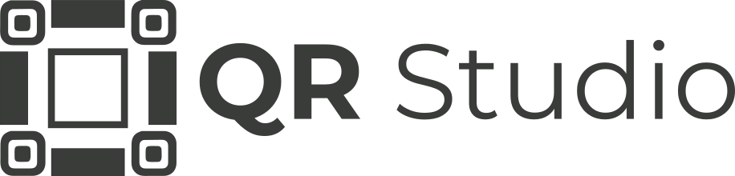

<p align="center">
  
</p>


[](https://github.com/joaogerd/qr-studio/actions/workflows/deploy.yml)
[](https://joaogerd.github.io/qr-studio/)
[](https://react.dev/)
[](https://vite.dev/)
[](https://www.gnu.org/licenses/lgpl-3.0.html)

> Transforme links e dados em QR Codes com alta qualidade visual, prontos para uso institucional, comercial e digital.

# QR Studio

O **QR Studio** é uma aplicação web para criação de QR Codes com foco em **personalização visual, legibilidade e acabamento profissional**. Em vez de apenas gerar um código simples, o projeto permite montar peças completas com identidade visual, molduras, templates, logo central e exportação em imagem, tudo processado diretamente no navegador.

## Visão geral

A proposta do QR Studio é unir a função técnica do QR Code com uma apresentação visual mais refinada. O usuário escolhe o tipo de conteúdo, define o estilo gráfico, aplica molduras ou templates e obtém uma prévia renderizada em tempo real em `canvas`, pronta para download.

Toda a aplicação funciona no front-end, sem necessidade de backend, o que torna o projeto simples de publicar, manter e evoluir.

## Funcionalidades principais

O QR Studio oferece suporte a múltiplos tipos de conteúdo e uma camada robusta de personalização visual.

### Conteúdo suportado

- URL
- Texto livre
- WhatsApp
- Wi-Fi
- E-mail
- vCard

### Personalização visual

- Estilos de módulos do QR
- Estilos dos olhos do QR
- Controle de cor do código
- Controle de cor de fundo
- Controle de cor do frame
- Upload de logo central
- Área segura automática para logo
- Controle de quiet zone
- Frames personalizados
- Templates visuais em formato de card

### Frames disponíveis

- Speech
- Badge
- Simple
- Double
- Ribbon
- Ticket

### Exportação

- PNG
- PNG em escala ampliada para maior nitidez

## Como o sistema funciona

O fluxo do projeto é dividido em etapas bem definidas.

Primeiro, a aplicação monta o payload final do QR de acordo com o tipo de conteúdo escolhido. Em seguida, a matriz do QR é gerada com a biblioteca `qrcode`. Depois disso, o motor de renderização desenha o resultado em `canvas`, aplicando fundo, módulos, olhos, frame, template e logo central. Por fim, o usuário pode exportar a arte final como imagem.

Essa separação entre conteúdo, renderização e interface foi pensada para facilitar manutenção e expansão futura.

## Arquitetura do sistema

O projeto foi estruturado com separação clara de responsabilidades.

```text
src/
├── App.jsx
├── main.jsx
├── index.css
├── components/            # Componentes de interface
│   ├── Hero.jsx
│   ├── PreviewCard.jsx
│   ├── ContentSection.jsx
│   ├── ColorSection.jsx
│   ├── StyleSection.jsx
│   ├── StyleWorkspace.jsx
│   ├── LogoSection.jsx
│   ├── NotesPanel.jsx
│   └── ui.jsx
├── qr/                    # Núcleo funcional do sistema
│   ├── constants.js
│   ├── qrContent.js       # Montagem do payload do QR
│   ├── qrRenderer.js      # Orquestração do canvas
│   ├── finderStyles.js    # Estilos dos olhos do QR
│   ├── templateRenderer.js
│   ├── templates.js
│   └── frames/            # Algoritmos de desenho das molduras
│       ├── index.js
│       ├── speechFrame.js
│       ├── badgeFrame.js
│       ├── simpleFrame.js
│       ├── doubleFrame.js
│       ├── ribbonFrame.js
│       └── ticketFrame.js
└── utils/
    ├── canvas.js
    └── download.js
````

## Tecnologias utilizadas

* React 18
* Vite
* Canvas API
* qrcode
* lucide-react
* framer-motion

## Como executar o projeto

### Pré-requisitos

* Node.js 18 ou superior
* npm

### Instalação

```bash
git clone https://github.com/joaogerd/qr-studio.git
cd qr-studio
npm install
```

### Ambiente de desenvolvimento

```bash
npm run dev
```

### Build de produção

```bash
npm run build
```

### Pré-visualização local do build

```bash
npm run preview
```

## Deploy

O deploy é automatizado com **GitHub Actions** e publicado no **GitHub Pages**. A cada push na branch `main`, o projeto é compilado e enviado automaticamente para a versão pública.

A aplicação publicada fica disponível em:

[https://joaogerd.github.io/qr-studio/](https://joaogerd.github.io/qr-studio/)

## Dicas de uso

A principal regra para QR Code continua sendo contraste e legibilidade. Mesmo com toda a liberdade visual oferecida pelo sistema, o ideal é manter o código visualmente mais escuro que o fundo, evitar excesso de estilização e testar o resultado em dispositivos reais antes de impressão ou publicação.

Logos muito grandes, contraste fraco ou combinações muito agressivas podem comprometer a leitura do QR.

## Estado atual do projeto

O núcleo principal da aplicação está funcional, incluindo geração, personalização, renderização e exportação. Algumas áreas da interface ainda podem evoluir, como a aba de estilos salvos, mas a base do sistema já está pronta para uso real e publicação.

## Licença

Este projeto está licenciado sob os termos da **LGPL v3**.
